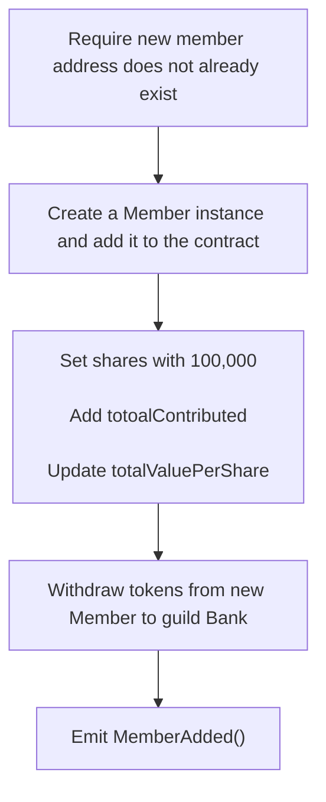

```mermaid

flowchart TD
A["Require new member address does not already exist"]
B["Create a Member instance and add it to the contract"]
C["Set shares with 100,000\n\nAdd totoalContributed\n\nUpdate totalValuePerShare"]
D["Withdraw tokens from new Member to guild Bank"]
E["Emit MemberAdded()"]
A --> B
B --> C
C --> D
D --> E

```