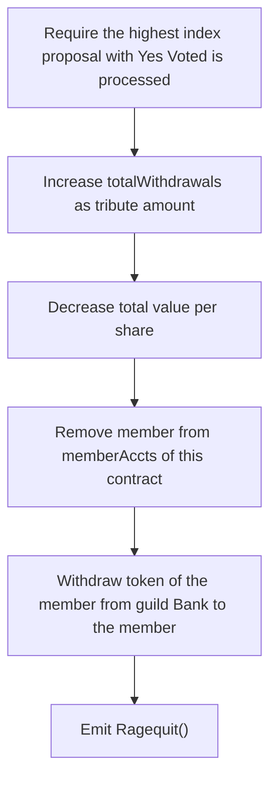

```mermaid

flowchart TD
A["Require the highest index proposal with Yes Voted is processed"]
B["Increase totalWithdrawals as tribute amount"]
C["Decrease total value per share"]
D["Remove member from memberAccts of this contract"]
E["Withdraw token of the member from guild Bank to the member"]
F["Emit Ragequit()"]
A --> B
B --> C
C --> D
D --> E
E --> F

```