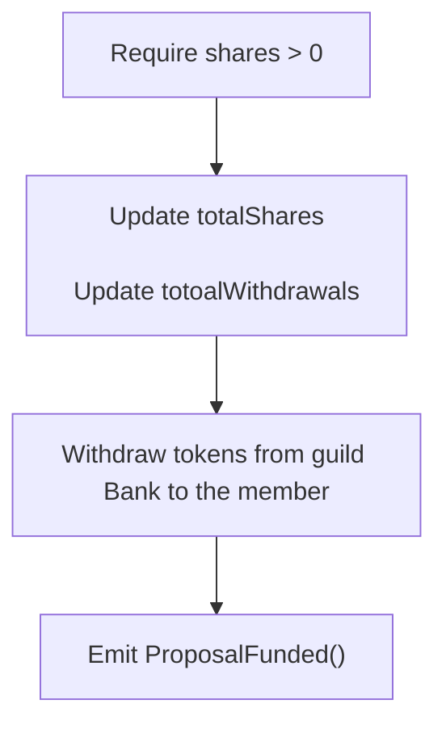

```mermaid

flowchart TD
A["Require shares > 0"]
B["Update totalShares\n\nUpdate totoalWithdrawals"]
C["Withdraw tokens from guild Bank to the member"]
D["Emit ProposalFunded()"]
A --> B
B --> C
C --> D

```