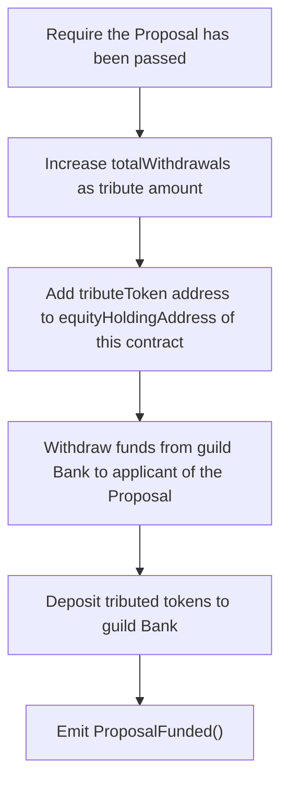

```mermaid

flowchart TD
A["Require the Proposal has been passed"]
B["Increase totalWithdrawals as tribute amount"]
C["Add tributeToken address to equityHoldingAddress of this contract"]
D["Withdraw funds from guild Bank to applicant of the Proposal"]
E["Deposit tributed tokens to guild Bank"]
F["Emit ProposalFunded()"]
A --> B
B --> C
C --> D
D --> E
E --> F

```