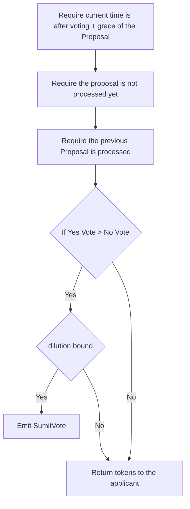

```mermaid

flowchart TD
A["Require current time is after voting + grace of the Proposal"]
B["Require the proposal is not processed yet"]
C["Require the previous Proposal is processed"]
D{"If Yes Vote > No Vote"}
E{"dilution bound"}
F["Emit SumitVote"]
G["Return tokens to the applicant"]
A --> B
B --> C
C --> D
D -- Yes --> E
D -- No ----> G
E -- Yes --> F
E -- No ---> G

```