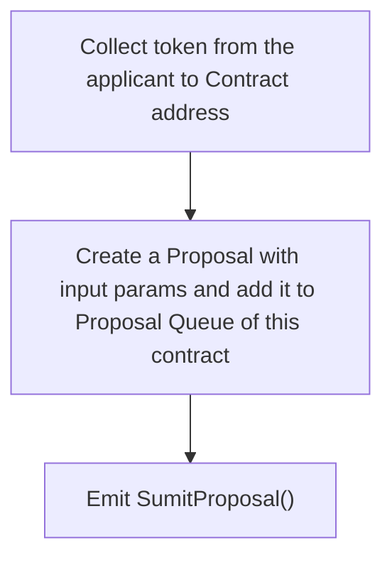

```mermaid

flowchart TD
A["Collect token from the applicant to Contract address"]
B["Create a Proposal with input params and add it to Proposal Queue of this contract"]
C["Emit SumitProposal()"]
A --> B
B --> C

```