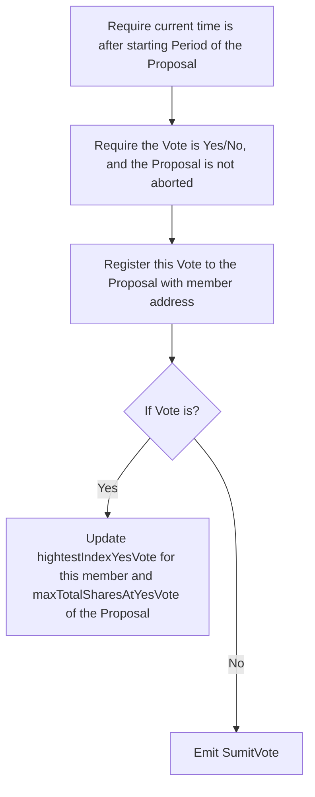

```mermaid

flowchart TD
A["Require current time is after starting Period of the Proposal"]
B["Require the Vote is Yes/No, and the Proposal is not aborted"]
C["Register this Vote to the Proposal with member address"]
D{"If Vote is?"}
E["Update hightestIndexYesVote for this member and maxTotalSharesAtYesVote of the Proposal"]
F["Emit SumitVote"]
A --> B
B --> C
C --> D
D -- Yes --> E
D -- No ----> F

```